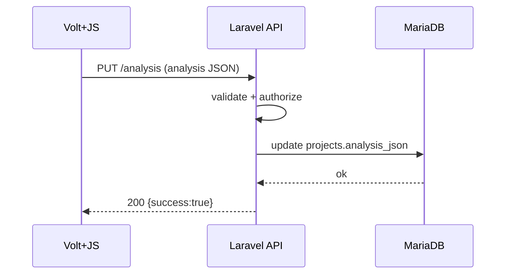

# Design: Analysis Core（保存モデル/API）

## Data model（MariaDB）
- projects
  - analysis_schema_version: varchar(32) NOT NULL
  - analysis_json: json NOT NULL
  - analysis_kva_raw: longtext NULL（将来: KVA passthrough/デバッグ用途）

## API
- GET  /api/projects/{project}/analysis
- PUT  /api/projects/{project}/analysis
  - body: { "analysis": <analysis-json> }

## Validation
- FormRequestで最低限チェック:
  - analysis.schema.name == "videocoach.analysis"
  - analysis.schema.version in {"1.0.0"}（将来拡張）
  - drawings/keyframes が配列であること
- 詳細スキーマ検証は後で段階導入（JSON schema等）

## Authorization
- ProjectPolicy: view/update

## Migration strategy
- app/Support/Analysis/AnalysisMigrator.php
  - migrate(array $analysis): array
  - バージョンごとに小さな変換関数を持つ

## Sequence（保存）

