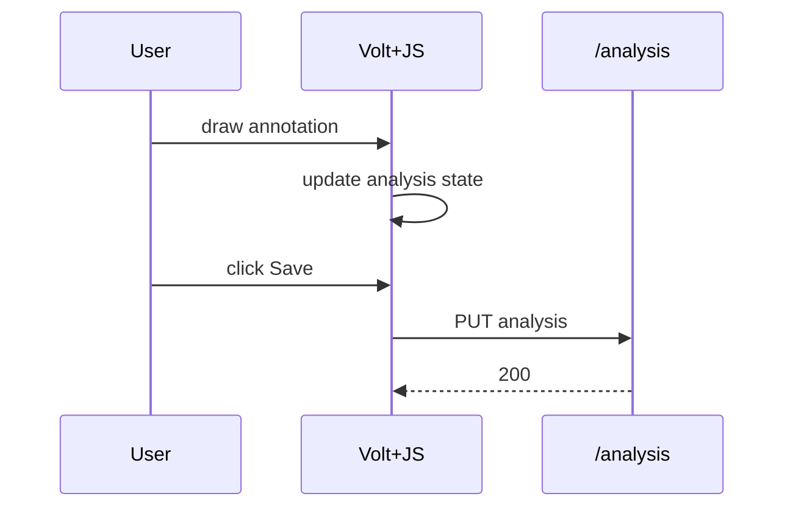

# Design: Editor MVP（Volt + JS主導）

## Frontend split
- Volt: レイアウト、プロジェクトメタ情報、保存ボタン、最小のパネル
- JS: Video/Canvas操作（高頻度イベント）
  - Canvas/Videoは `wire:ignore` の領域に置く

## Coordinate model（重要）
- 保存座標は「動画の実ピクセル座標」
- 描画時に video → canvas へ変換（object-fit/letterbox対応）
  - videoRect（実表示領域）を計算し、scale + offset で相互変換

## Data flow
- onLoad: GET /analysis → stateへ反映 → redraw
- onEdit: state更新 → redraw
- onSave: PUT /analysis

## Modules
- resources/js/editor/video-controller.js
- resources/js/editor/canvas-mapper.js（座標変換）
- resources/js/editor/tools/*（各ツール）
- resources/js/editor/store.js（analysis state）

## Sequence（保存）

